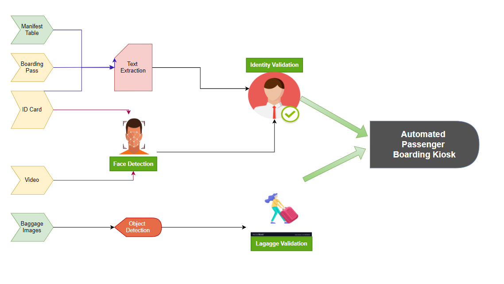
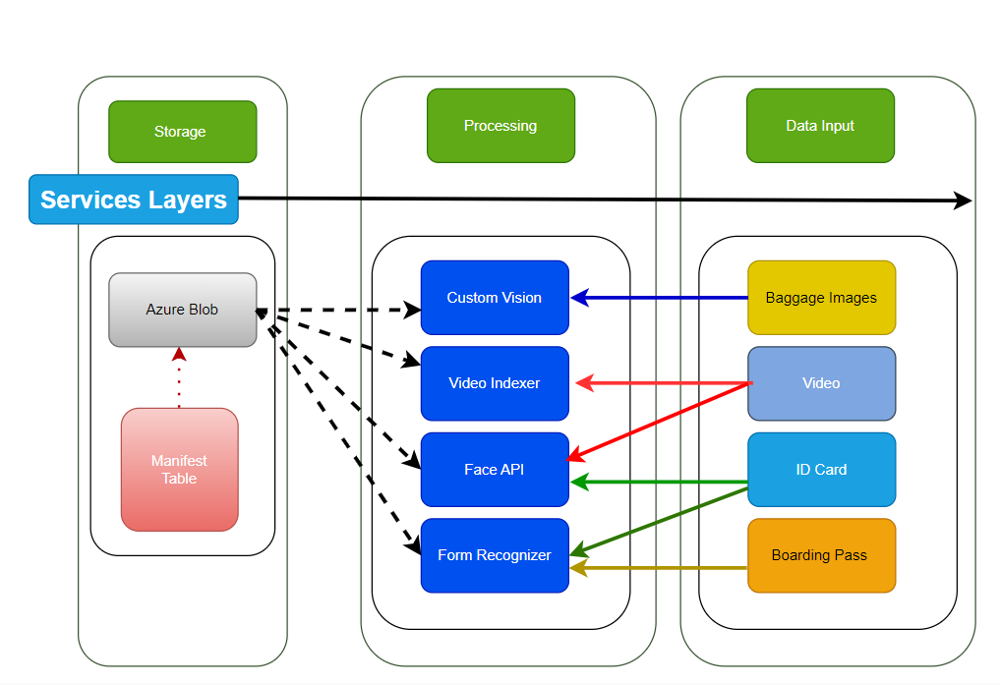

# Automated-Passenger-Boarding-Kiosk

## Overview
This project leverages Azure's AI services to automate and streamline the pre-flight boarding process. By using computer vision technology, the kiosk performs tasks such as identity verification, boarding pass recognition, emotion detection, and prohibited item detection, enhancing both security and efficiency at airports.

## Introduction
The traditional boarding process often involves time-consuming manual checks, which can create delays and inefficiencies. Introducing an automated passenger boarding kiosk addresses these issues by utilizing computer vision technology to streamline the process. This system not only enhances security by ensuring accurate passenger identification but also speeds up the boarding process, leading to a more efficient and seamless experience for passengers

## Requirements

#### Scan and Verify Passenger Information
- Capture and scan the passenger's ID card and boarding pass.
- Extract and cross-reference details between the boarding pass, ID card, and flight manifest.

#### Facial Recognition
- Record a 15-30 second video of the passenger.
- Use facial recognition to match the video with the ID card photo.

#### Prohibited Item Detection
- Scan carry-on baggage to detect prohibited items.
- Prevent boarding if any prohibited items are found.

#### Validation and Messaging
- Display a boarding confirmation if all validations are successful.
- Advise the passenger to see an airline representative if issues arise.

#### Simulated Kiosk Experience
- Create a manifest with 5+ passengers and generate corresponding digital IDs and boarding passes.
- Include a fabricated ID and video for facial recognition testing.
- Scan and flag prohibited items like lighters in carry-on baggage.
- Simulate the boarding process using Azure computer vision services.

#### Input Data Sources
- Flight manifest for 5 passengers.
- 5 digital ID cards and boarding passes.
- 15-30 second videos of each passenger’s face.
- Photos of each passenger's carry-on items.



### Solution Strategy

1. Train Azure Form Recognizer model to extract passenger info from boarding passes
2. Use Face API and Form Recognizer to extract face and personal info from digital IDs
3. Validate passenger info from boarding pass against manifest list
4. If name exists in manifest, validate identity from personal ID
5. Verify face from digital ID matches face from passenger video using Video Indexer
6. Train Azure Custom Vision model to identify lighters in carry-on images
7. Test Custom Vision model on sample carry-on images
8. Display final validation success/failure message to complete boarding process




### Azure AI Services Used

- [AI Video Indexer API](https://www.videoindexer.ai) (formerly Video Recognizer)
- [Form Recognizer Tool](https://fott-2-1.azurewebsites.net/) (now Document Intelligence)
- [Custom Vision](https://www.customvision.ai/)
- Face API

## Project Summary

The automated passenger boarding kiosk prototype exemplifies the practical implications of cutting-edge technology in real-world scenarios. By seamlessly integrating Azure services and custom computer vision models, the system demonstrates the feasibility of automating complex processes within the airline industry. From digital ID recognition to emotion detection and beyond, the project showcases how advancements in AI can revolutionize traditional workflows, offering tangible benefits in terms of efficiency, accuracy, and passenger satisfaction. Through the submission of project deliverables via GitHub repositories, participants contribute to the ongoing evolution of AI-driven solutions in the aviation sector, paving the way for future innovations and enhancements in passenger boarding experiences.
## Implementation

### Installation

- All required Python packages can be found in the [_requirements.txt_](step_05_validation_metrics_monitoring/requirements.txt) file (see step 5).
- All environment variables have been stored in a _.env_ file at the main folder of this project:

```bash
AZURE_USERNAME=...
AZURE_PASSWORD=...

STORAGE_ACCOUNT_NAME=...
LOCATION=...

AZURE_FORM_RECOGNIZER_ENDPOINT=...
AZURE_FORM_RECOGNIZER_KEY=...
AZURE_BLOB_CONTAINER_SAS_URI=...

VIDEO_RECOGNIZER_SUBSCRIPTION_KEY=...
VIDEO_RECOGNIZER_ACCOUNT_ID=...

FACE_API_KEY=...
FACE_API_ENDPOINT=...

CUSTOM_VISION_TRAINING_ENDPOINT=...
CUSTOM_VISION_TRAINING_KEY=...
CUSTOM_VISION_TRAINING_RESOURCE_ID=...

CUSTOM_VISION_PREDICTION_ENDPOINT=...
CUSTOM_VISION_PREDICTION_KEY=...
CUSTOM_VISION_PREDICTION_RESOURCE_ID=...

STORAGE_ACCOUNT_CONNECTION_STRING=...
```
